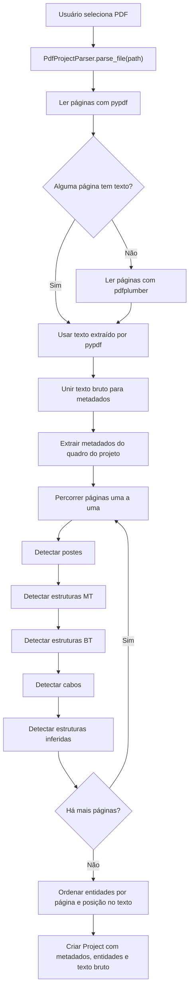
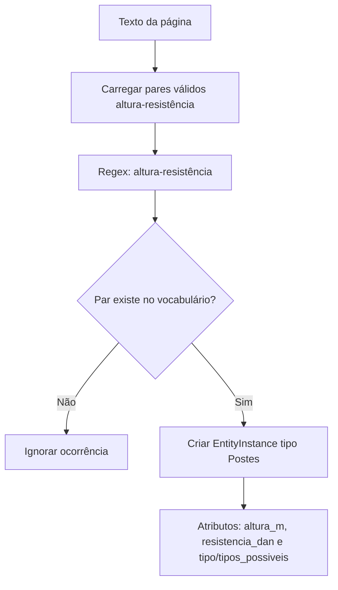
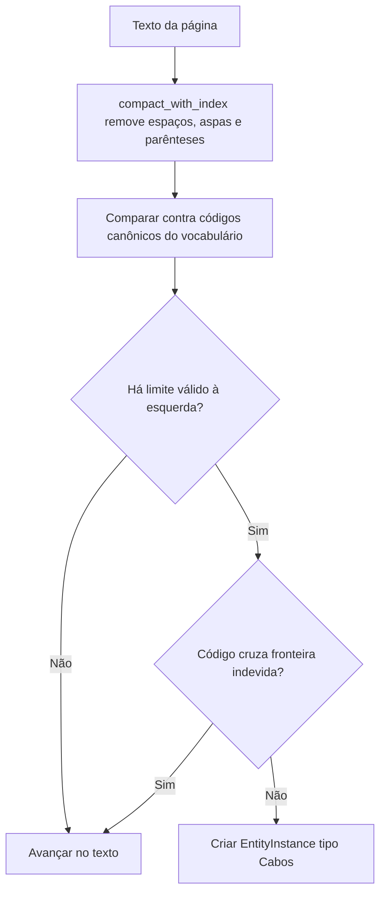

# Fluxograma de Análise do PDF

Este documento descreve como o algoritmo do `ProjectHandler` lê um PDF de projeto de rede, extrai texto e determina as entidades exibidas na interface.

## Fluxograma Geral

## Fontes de Dados

O vocabulário de entidades vem de `src/projecthandler/data/entity_definitions.json`, gerado a partir da planilha de exemplos pelo script `scripts/import_entities_from_excel.py`.

O `EntityRepository` monta índices auxiliares:

- `pole_records_by_pair()`: postes por par `(altura_m, resistencia_dan)`.
- `records_by_name("estruturas_mt")`: estruturas MT por código normalizado.
- `records_by_name("estruturas_bt")`: estruturas BT por código normalizado.
- `cable_records_by_code()`: cabos por código canônico.

## Extração de Metadados

1. O texto completo do PDF é compactado com `collapse_whitespace`.
2. O parser procura rótulos conhecidos, como `Circuito`, `Dispositivo`, `Cidade`, `Cliente`, `Serviço`, `DATA`, `NS` e `FOLHA`.
3. O valor de cada campo é o trecho entre o rótulo atual e o próximo rótulo.
4. `_clean_metadata_value()` aplica regras específicas:
   - `data`: captura `dd/mm/aaaa`.
   - `ns`: captura sequência numérica com 6 ou mais dígitos.
   - `folha`: captura `n/n` ou número simples.
   - `escala`: captura padrões como `1:1000`.

## Determinação de Postes

Exemplo detectável: `11-300`.

Quando mais de um tipo físico é possível para o mesmo par, o algoritmo registra `tipos_possiveis` em vez de escolher arbitrariamente.

## Determinação de Estruturas MT e BT

Para estruturas de média e baixa tensão, o parser usa `_extract_named_structures()`:

1. Busca os códigos `nome` do vocabulário.
2. Normaliza texto e códigos com `normalize_with_index()`, removendo acentos e padronizando caixa alta sem perder a posição original.
3. Ordena códigos por tamanho, do maior para o menor, para evitar capturar prefixos indevidos.
4. Aceita sufixos de variante, como `U3.2`.
5. Aceita quantidade entre parênteses, como `U3(2)`.
6. Cria `EntityInstance` com tipo, página, quantidade, atributos da planilha e contexto textual.

Exemplos detectáveis:

- `U1`, `U3(2)`, `N4`: estruturas MT.
- `S1N`, `S3R`, `SI4R`: estruturas BT.

## Determinação de Cabos

Cabos usam um fluxo próprio porque os PDFs frequentemente apresentam códigos com espaços, parênteses ou concatenação.

Exemplos detectáveis:

- `A-4 CA`
- `B-4 CAA`
- `N-(4 CA)`, convertido para o código canônico `(N-4 CA)`
- `ABN-35(70)`

A função `_long_cable_crosses_boundary()` evita que um cabo menor mais texto adjacente seja interpretado como cabo maior quando há separadores no trecho original.

## Estruturas Inferidas

Depois das entidades conhecidas, `_extract_unknown_structures()` procura códigos com prefixos técnicos esperados, como `U`, `N`, `M`, `B`, `S`, `SI`, `SAI`, `CE`, `CM`, `CEM`, `CEBS`.

Uma estrutura é inferida apenas quando:

- o código não existe nos vocabulários MT/BT;
- o código não está na lista de termos ignorados;
- o trecho não sobrepõe uma entidade já encontrada;
- há dígito no código ou quantidade explícita.

Essas entidades recebem:

- `origem: inferido`;
- `confidence: 0.6`;
- observação informando que o código está ausente no vocabulário importado.

## Resultado Final

Ao final, o parser ordena todas as entidades por página e posição no texto. O objeto `Project` contém:

- `name`: nome do arquivo ou origem textual;
- `source_path`: caminho do PDF original;
- `metadata`: campos do quadro do projeto;
- `entities`: instâncias detectadas;
- `raw_text`: texto bruto extraído.

A interface usa `Project.grouped_entities()` para agrupar as entidades por tipo e exibir as abas internas da tela `Entidades`.

## Manutenção Obrigatória

Sempre que a lógica de análise for alterada em `parser.py`, `entity_repository.py`, `text_utils.py`, `scripts/import_entities_from_excel.py` ou no formato de `entity_definitions.json`, este fluxograma deve ser revisado e atualizado quando necessário.

